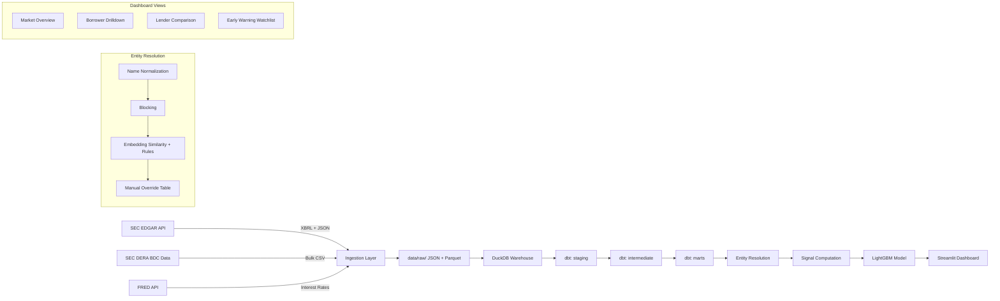

# PLAN: Private Credit Early Warning Radar

## Architecture



## Folder Layout

```
01-private-credit-radar/
  src/
    ingest.py           # SEC EDGAR + DERA ingestion
    entity_resolution.py # Borrower name matching
    signals.py           # Mark drift, dispersion, PIK migration
    model.py             # LightGBM early warning model
    app.py               # Streamlit dashboard
  transforms/
    dbt_project.yml
    models/
      staging/           # stg_filings, stg_soi_positions, stg_fred_rates
      intermediate/      # int_canonical_borrowers, int_quarterly_panel
      marts/             # mart_signals, mart_watchlist, mart_lender_comparison
    tests/
  tests/
    test_ingest.py
    test_entity_resolution.py
    test_signals.py
    test_model.py
  data/
    raw/                 # EDGAR JSON, DERA CSV
    sample/              # Small fixture for CI
    processed/           # Parquet outputs
  models/                # Trained model artifacts
  company_profiles/
  outputs/customize/
  docs/
    loom_script.md
  LEARNING.md
  LIMITATIONS.md
```

## Stages

### Stage 1: Ingestion
- Pull SOI facts for 30+ BDCs over 8 quarters using SEC EDGAR XBRL APIs
- Download DERA BDC bulk data sets if available
- Store raw JSON/CSV in data/raw/
- Create sample fixture in data/sample/ with 3 BDCs x 4 quarters
- Idempotent: skip already-downloaded filings
- Validation: row counts and fair value totals reconcile within 1%

### Stage 2: dbt Staging Models
- Set up dbt-duckdb project in transforms/
- staging models: stg_filings, stg_soi_positions, stg_fred_rates
- Tests: not_null, unique, accepted_values on key columns
- Load sample fixture into DuckDB and run dbt

### Stage 3: Entity Resolution
- Normalize borrower names (strip legal suffixes, punctuation, case)
- Blocking by industry + first letter
- Embedding similarity (sentence-transformers on CPU) + rule-based matching
- Manual override table (CSV)
- Target: 95%+ precision on 200 hand-labeled pairs (you label these)
- Report recall honestly

### Stage 4: Panel and Signal Marts
- int_quarterly_panel: borrower x lender x quarter
- Signals: mark_drift, cross_lender_dispersion, lender_lag, pik_migration, par_migration
- Document each formula in a YAML metadata file
- dbt tests on signal ranges and nulls

### Stage 5: Early Warning Model
- Target: non-accrual or mark below threshold next quarter
- Baseline: logistic regression on mark level alone
- Main: LightGBM with time-based splits (train on quarters 1-6, validate 7, test 8)
- Metrics: PR-AUC, precision@50, calibration plot
- Feature importance analysis
- No leakage: features only from prior quarters

### Stage 6: Dashboard
- Streamlit app with 4 views: market_overview, borrower_drilldown, lender_comparison, watchlist
- ?company= parameter for customization
- Research disclaimer on every page

### Stage 7: Orchestration and CI
- Airflow DAG (or Dagster) for quarterly refresh
- GitHub Actions: lint + test on sample fixture

### Stage 8: Deploy
- Precompute DuckDB file with results
- Deploy to Streamlit Community Cloud
- DEPLOY.md with exact steps

## Open Questions
1. DERA BDC bulk data URL - need to verify it's still available
2. Airflow vs Dagster - Dagster is lighter, recommend Dagster for 16GB RAM
3. Entity resolution recall target - spec says "report honestly" but no minimum. Suggest targeting 80%+ recall
